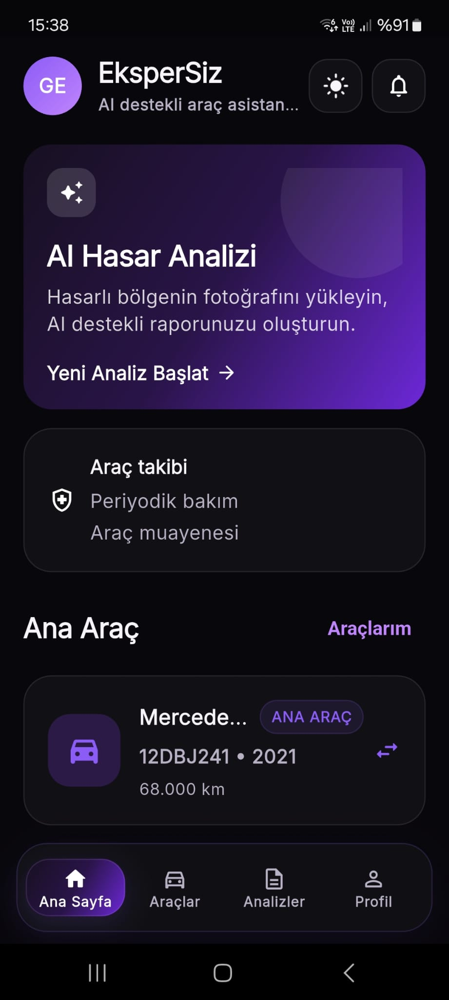
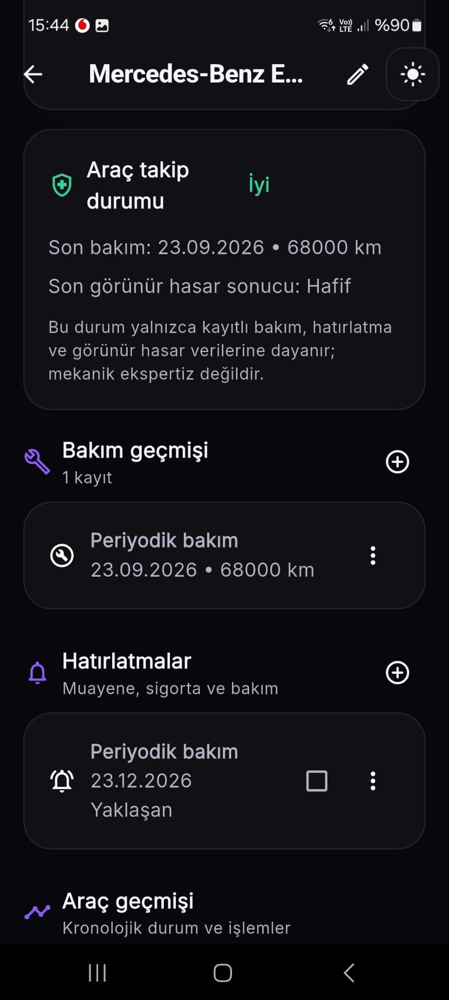
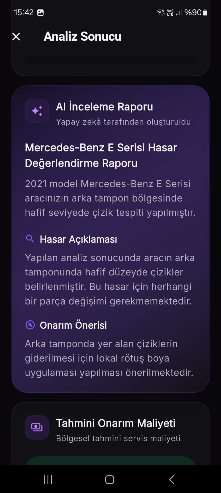
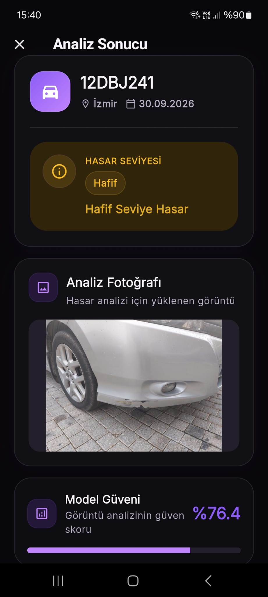

# 🚗 EksperSiz

**AI-powered vehicle inspection and management application for Android.**

EksperSiz analyzes vehicle photos using computer vision to detect visible damage and affected parts, then generates AI-assisted inspection reports with repair recommendations and estimated repair costs.

The application also provides vehicle management, maintenance tracking, reminders, nearby automotive services, business accounts, notifications, and integrated payments.

> Currently in **Google Play closed testing**.

---

## 📱 Screenshots

<p align="center">
  
  &nbsp;
  
  &nbsp;
  
  &nbsp;
  
</p>

---

## ✨ Features

### AI Vehicle Inspection
- YOLO-based vehicle damage and affected-part detection
- Image suitability validation before analysis
- Damage severity classification and repair recommendations
- Gemini-powered inspection reports
- Location-aware repair-cost estimation
- Inspection history and report regeneration
- PDF report export and native sharing

### Vehicle Management
- Vehicle profiles and main vehicle selection
- Maintenance and mileage tracking
- Date- and mileage-based reminders
- Unified vehicle and inspection history
- Vehicle condition overview

### Authentication & Services
- Email/password authentication with JWT
- Google Sign-In with server-side token verification
- Email verification and password reset through Brevo
- Google Maps & Places for nearby automotive services
- Firebase Cloud Messaging and persistent notifications
- Turkish / English interface and light / dark themes

### Billing & Business
- Freemium AI analysis system
- One-time AI report credits
- RevenueCat server-side purchase verification and webhooks
- Business accounts with OWNER / MEMBER roles
- Shared company vehicles and inspection history
- Shared monthly analysis limits

---

## 🛠 Tech Stack

| | Technologies |
| --- | --- |
| **Mobile** | Flutter, Dart |
| **Backend** | Java 21, Spring Boot, Spring Security, JPA, Flyway |
| **AI / ML** | Python, FastAPI, YOLO, PyTorch, Gemini API |
| **Database** | PostgreSQL |
| **Services** | Firebase, Google Maps & Places, RevenueCat, Brevo |
| **Infrastructure** | Docker, Railway |

---

## 🏗 Architecture

```text
Flutter Android App
        │
        │ HTTPS
        ▼
Spring Boot REST API
        │
        ├── PostgreSQL
        ├── FastAPI / YOLO
        ├── Google Gemini
        ├── Google Places
        ├── RevenueCat
        ├── Firebase Cloud Messaging
        └── Brevo
```

The Spring Boot backend and FastAPI/YOLO service are containerized with Docker and deployed on **Railway**. PostgreSQL and persistent image storage are also managed within the deployment environment.

Runtime secrets and credentials are supplied through environment variables and are not committed to the repository.

---

## 🤖 AI Pipeline

```text
Vehicle Photo
     │
     ▼
Image Validation
     │
     ▼
Vehicle Detection
     │
     ▼
Damage Detection
     │
     ▼
Vehicle Part Detection
     │
     ▼
Damage ↔ Part Matching
     │
     ▼
Structured ML Result
     │
     ▼
Gemini Report
     │
     ├── Damage summary
     ├── Repair recommendation
     └── Estimated repair cost
```

The computer-vision pipeline detects damage types including:

`SCRATCH` · `DENT` · `CRACK` · `BROKEN_PART` · `BROKEN_GLASS`

The application also supports `PAINT_DAMAGE`, `DEFORMATION`, and `NO_VISIBLE_DAMAGE`.

ML analysis and Gemini report generation are handled separately. If report generation fails, the completed ML result remains available and the report can be regenerated without running the computer-vision analysis again.

More information about dataset preparation, training and model evaluation is available in [`ai-service/README.md`](ai-service/README.md).

---

## 🔐 Security

- JWT-based stateless authentication
- BCrypt password hashing
- Server-side Google ID-token verification
- Secure mobile token storage
- Role and business-membership authorization
- Upload MIME-type and file-signature validation
- Path-traversal protection
- Server-side RevenueCat verification
- Environment-based secrets
- Non-root backend container
- HTTPS production API

---

## 🧪 Testing & Deployment

The project includes automated **Spring Boot backend tests** and **Flutter tests** covering important application and business flows.

Production architecture:

- **Mobile:** Google Play
- **Backend:** Spring Boot / Railway
- **AI Service:** FastAPI + YOLO / Railway
- **Database:** PostgreSQL
- **Containers:** Docker

The Android application is currently undergoing **Google Play closed testing** before its production release.

---

## 📂 Project Structure

```text
ekspersiz/
├── backend/       # Spring Boot REST API
├── mobile/        # Flutter Android application
├── ai-service/    # FastAPI / YOLO service
└── README.md
```

---

## 👨‍💻 Developer

**Görkem Ertaş**  
Software Engineer — Backend & AI/ML